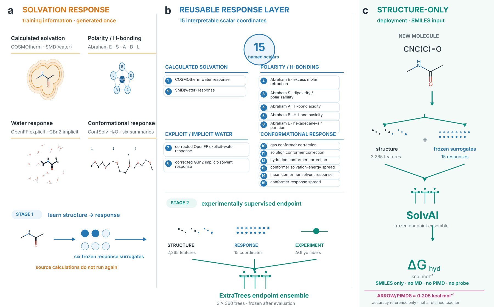

# SolvAI

**SolvAI distils solvent-response physics into a molecular model that predicts
hydration free energies directly from structure—without molecular simulation at
inference.**



Expensive quantum chemistry and molecular simulation normally resolve solvent
response separately for every molecule. SolvAI instead learns structure-to-
response surrogates from benchmark-disjoint physical calculations, combines
their predictions with molecular descriptors, and returns hydration free energy
from a SMILES string. It runs no MD, PIMD, ARROW trajectory, probe or routing
policy at deployment.

## Result

On the 85-solute neutral-hydration reference set introduced with ARROW:

| Method | Inference simulation? | MAE (kcal/mol) |
|---|---:|---:|
| Classical ARROW | yes | 0.785 |
| ARROW/PIMD8 | yes | 0.205 |
| Previous structure-only model | no | 0.239 |
| SolvAI, strict five-fold OOF | **no** | **0.197** |
| SolvAI, five independent splits | **no** | **0.204 ± 0.005** |

The exact sub-0.20 point estimate is split-sensitive. The supported conclusion
is that SolvAI reaches PIMD8-level accuracy on this molecular reference set;
robust sub-0.20 generalization is not claimed. Family and scaffold holdouts are
0.240 and 0.241 kcal/mol, respectively.

## Install and predict

Prerequisites are Python 3.11 and [uv](https://docs.astral.sh/uv/). Git LFS is
required when cloning the bundled model artifacts.

```bash
git lfs install
git clone https://github.com/Scientific-Computing-Lab/SolvAI.git
cd SolvAI
make setup
uv run solvai predict 'CCO'
```

Output columns are input SMILES, ensemble-mean hydration free energy and
ensemble spread, all energy values in kcal/mol:

```text
CCO    -5.020248    0.005697
```

Python API:

```python
from solv_ai import predict_smiles

prediction, spread = predict_smiles(["CCO", "c1ccccc1"])
```

## Reproduce the paper

```bash
make test
make verify
make figures
make paper
```

This quick route uses frozen, hash-verified artifacts and recomputes every
headline number from molecule-level held-out predictions. It does not rerun
physics calculations or training. See
[QUICK_REPRODUCTION.md](repro/QUICK_REPRODUCTION.md) and
[FULL_REPRODUCTION.md](repro/FULL_REPRODUCTION.md) for the two scopes.

The compiled [main manuscript](paper/main.pdf) and
[Supplementary Information](paper/supplementary/supplementary.pdf) follow the
Nature submission separation: Extended Data are standalone files in
`paper/extended_data/`, not figures embedded in the Supplementary Information.
Machine-readable paper metrics are in
[results/paper_metrics.json](results/paper_metrics.json).

## Scientific safeguards

- Every external supervised training connectivity is disjoint from ARROW-85.
- Every accuracy value is held out; the all-data deployment refit is never used
  to score the paper.
- The final input schema contains no experimental, ARROW, PIMD, trajectory,
  probe, family, scaffold or fold field.
- The selected artifact uses no PIMD8 label. Sparse PIMD response supervision
  was tested, did not improve OOF accuracy, and is reported as an ablation.
- The software reproduces the frozen metric and artifact audits in CI.

See the [leakage audit](audits/leakage_audit.md),
[model card](models/final/MODEL_CARD.md) and
[data provenance](repro/DATA_PROVENANCE.md).

## Repository map

- `solv_ai/` — public inference, feature and audit code
- `models/final/` — frozen response teachers and endpoint ensemble
- `results/` — held-out predictions, metrics and ablations
- `figures/` — source-generated main and Extended Data figures
- `paper/` — manuscript and Supplementary Information
- `repro/` — quick/full reproduction and provenance
- `submission/` — editorial and availability documents

## Citation and licence

Citation metadata are provided in `CITATION.cff`. Source code is MIT licensed.
External data and model inputs retain the terms listed in
`repro/DATA_PROVENANCE.md`.
