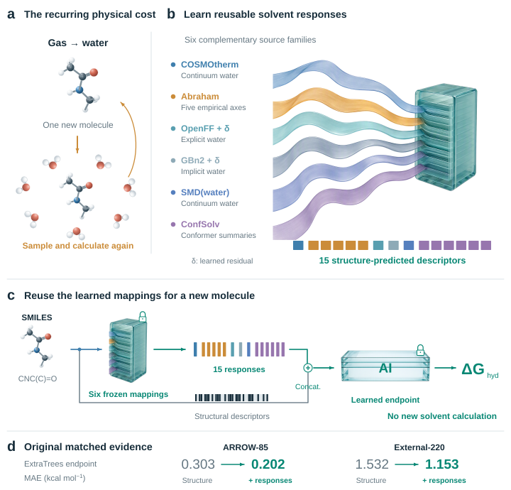

# SolvAI

**SolvAI learns reusable solvent-response coordinates from calculated, empirical and
corrected solvation data and predicts hydration free energy directly from molecular
structure—without running simulation at inference.**



SolvAI predicts 15 solvent-response descriptors from six source families, then
combines them with molecular structure in a learned hydration endpoint. The response
representation is shared across the tested endpoint families; SolvAI is not a
particular endpoint algorithm. Inference starts from SMILES and does not rerun the
source calculations. PIMD-derived features were tested but are not in the final
response set.

## Endpoint comparison

The journal study evaluates ExtraTrees, residual and dual-branch MLPs, a
ridge-plus-neural residual, size-sensitive message passing, frozen MoLFormer with
neural and tree heads, TabM and TabPFN-3.5. All nine fixed configurations have
matched fits with and without the 15 responses on the same three evaluation
cohorts. Those fits test the value of the representation separately from the
absolute-error ranking. No endpoint wins every evaluation.

| Endpoint with responses | ARROW-85 | External-220 | Strict-97 | Size holdout |
|---|---:|---:|---:|---:|
| ExtraTrees | 0.202 | 1.153 | 1.536 | 1.772 |
| Residual MLP | 0.340 | 1.428 | 2.016 | 1.813 |
| Dual branch | 0.288 | 1.234 | 1.616 | 1.560 |
| Ridge + neural residual | 0.336 | 1.172 | 1.429 | 1.391 |
| Message passing | 0.288 | 1.168 | 1.505 | 1.729 |
| MoLFormer + neural head | 0.273 | 1.111 | 1.450 | 1.609 |
| TabM | 0.291 | 1.132 | 1.454 | 1.389 |
| TabPFN-3.5 | 0.199 | 1.134 | 1.493 | 1.318 |
| MoLFormer + ExtraTrees | 0.234 | 1.174 | 1.564 | not evaluated |

MAE is in kcal/mol. The strict set is nested within External-220. The size
diagnostic refits eight configurations on 1,160 labels and evaluates
205 size-held-out molecules, reusing development data. Its source surrogates stay
fixed, and endpoint input recipes differ; the contrast does not isolate architecture
alone or test a pipeline with all upstream source exposure removed. Responses do not
benefit TabPFN uniformly. Peptide curves have no experimental reference and native
TabPFN intervals under-cover. The architecture study is retrospective, with final
configurations selected inside training pools. Complete results and
reproduction details: [`repro/endpoint_models/`](repro/endpoint_models/README.md).
## Matched response controls with ExtraTrees

One endpoint has additional prespecified alignment, shuffling, partition and
chemical-separation controls. On ARROW-85, adding responses to a matched ExtraTrees
fit lowers MAE from 0.303 to 0.202 kcal/mol (paired OOF change −0.101; 95%
bootstrap interval, −0.215 to −0.020). The labels, structural features,
weights, folds and seeds are identical across the pair. Shuffling the responses
abolishes the gain. ARROW/PIMD8 has an MAE of 0.205 on this chemistry but is an
accuracy reference, not a model input.

On a prospectively frozen external cohort, the same matched comparison lowers MAE
from 1.532 to 1.153 kcal/mol (N=220). In its nested 97-molecule subset absent from
all six supervised response-source tables, the corresponding errors are 2.138 and
1.536. These tests support response usefulness for this endpoint; they do not imply
PIMD8-level absolute accuracy beyond ARROW-85 or the same effect size for every
endpoint. The public inference command below uses this packaged ExtraTrees endpoint.

## Install and predict

Python 3.11, [uv](https://docs.astral.sh/uv/) and Git LFS are required.

```bash
git lfs install
git clone https://github.com/Scientific-Computing-Lab/SolvAI.git
cd SolvAI
make setup
uv run solvai predict 'CCO'
```

The command returns the ensemble-mean hydration free energy and ensemble spread in
kcal/mol:

```text
CCO    -5.012566    0.004714
```

The API is equally small:

```python
from solv_ai import predict_smiles

prediction, spread = predict_smiles(["CCO", "c1ccccc1"])
```

On the release CPU host, the packaged artifact has a 15.29 s warm single-molecule
median and processes a batch of 32 in 15.82 s (0.494 s per molecule). Startup of the
two response D-MPNNs dominates single-query latency; no simulation is performed.

## Reproduce the paper

```bash
make test && make verify && make figures && make paper
```

This path checks the original release and rebuilds its metrics and displays from
frozen artifacts. It does not rerun physical calculations or model training;
the journal extension's additional rebuild commands are documented below and in
`repro/endpoint_models/`. The preregistered confirmation protocol is in
[`release/CONFIRMATORY_FREEZE.md`](release/CONFIRMATORY_FREEZE.md), with results in
[`reports/CONFIRMATORY_ANALYSIS.md`](reports/CONFIRMATORY_ANALYSIS.md).
The prospectively frozen external protocol and report are
[`release/TIER_A_EXTERNAL_VALIDATION_FREEZE.md`](release/TIER_A_EXTERNAL_VALIDATION_FREEZE.md)
and [`reports/TIER_A_EXTERNAL_VALIDATION.md`](reports/TIER_A_EXTERNAL_VALIDATION.md).

The compiled [journal manuscript](paper/main.pdf) is one continuous PDF containing
the main text, references and Supplementary Information (eight main figures, twelve
supporting figures and sixteen supplementary tables). `make journal-paper` rebuilds
this complete document from the existing figures and tables; the supplement
is included automatically, never compiled as a separate default deliverable.
Machine-readable Supplementary Data are also included. See
[`paper/README.md`](paper/README.md),
[`repro/QUICK_REPRODUCTION.md`](repro/QUICK_REPRODUCTION.md),
[`repro/FULL_REPRODUCTION.md`](repro/FULL_REPRODUCTION.md) and
[`repro/DATA_PROVENANCE.md`](repro/DATA_PROVENANCE.md).

## Scientific safeguards

- Exact and standardized benchmark equivalents are absent from all supervised
  external training sources used by the confirmatory model.
- Every reported accuracy value is held out; the all-data deployment refit is never
  used as evidence.
- Shuffled-response, global chemical-separation and zero-ARROW-label controls
  are included molecule by molecule for the ExtraTrees configuration; matched
  response/no-response fits cover all nine fixed configurations.
- Tier-A eligibility was frozen before evaluation; all 220 rows are endpoint-disjoint
  and the strict 97-molecule subset is also response-source-disjoint.
- Inference requires no experimental target, family/scaffold label, MD, PIMD, ARROW
  trajectory, probe or routing policy.
- The released artifact contains no retained PIMD-trained feature.
- The returned ensemble spread is not a calibrated applicability or reliability
  score; the validated scope is neutral small-molecule hydration chemistry.

## Repository map

- `solv_ai/` — SMILES-only inference and metric code
- `models/final/` — standardized-exclusion response surrogates and endpoint ensemble
- `results/confirmatory/` — preregistered predictions, comparisons and statistics
- `audits/confirmatory/` — identity, similarity and refit audits
- `paper/` — unified journal manuscript, vector figures and Supplementary Data
- `repro/` — quick/full reproduction and data provenance

Citation metadata are provided in `CITATION.cff`. Code is MIT licensed; external
datasets retain the terms listed in the provenance record.
