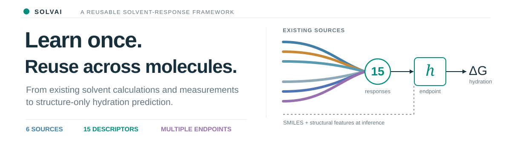

# SolvAI

<p align="center">
  
</p>

<p align="center">
  <a href="paper/main.pdf">Read the manuscript and supplement</a> ·
  <a href="#the-results">Explore the results</a> ·
  <a href="#quick-start">Run a prediction</a> ·
  <a href="repro/QUICK_REPRODUCTION.md">Reproduce the paper</a>
</p>

SolvAI turns **existing physical and empirical solvent data** into 15 molecular response descriptors predicted from structure. The descriptors can be combined with different endpoint models to predict hydration free energy. After training, a query starts with a SMILES string; the released predictor performs **no new solvent simulation**.

The research question is not whether one model can imitate a particular simulation. It is whether solvent-response information can be learned once, reused across molecules, and remain useful when the hydration predictor changes.

## The results

In a matched ExtraTrees implementation, adding the 15 predicted responses changes only the response feature block; labels, folds, structural features, weights and model seeds remain fixed.

| Evaluation | Structure only | + Responses | Molecules |
|:--|--:|--:|--:|
| ARROW-85, out of fold | 0.303 | **0.202** | 85 |
| External-220, endpoint-disjoint | 1.532 | **1.153** | 220 |
| Strict-97, also response-source-disjoint | 2.138 | **1.536** | 97 |

Values are mean absolute error (MAE), kcal mol⁻¹. The strict 97 are a subset of the external 220, not a separate fit. The published ARROW/PIMD8 value is 0.205 on the same 85 molecules: an **accuracy reference**, not a SolvAI training target or evidence of physical equivalence. Shuffling molecule-to-response assignments removes the matched ARROW gain. These alignment and chemical-separation controls were run for ExtraTrees; the broader endpoint study uses its own matched response/no-response comparisons.

### One representation, different endpoint behaviors

The same 15 frozen response predictions were tested across tree ensembles, neural networks, message-passing graphs, pretrained molecular encoders, TabM and TabPFN-3.5. The lowest *absolute* MAE and the strongest *benefit from adding responses* are different questions. Seven of nine fixed endpoint configurations show a response-associated reduction on External-220 and its nested Strict-97 subset.

| Endpoint with responses | ARROW-85 | External-220 | Strict-97 | Size holdout |
|:--|--:|--:|--:|--:|
| ExtraTrees | 0.202 | 1.153 | 1.536 | 1.772 |
| Residual MLP | 0.340 | 1.428 | 2.016 | 1.813 |
| Dual branch | 0.288 | 1.234 | 1.616 | 1.560 |
| Ridge + neural residual | 0.336 | 1.172 | **1.429** | 1.391 |
| Message passing | 0.288 | 1.168 | 1.505 | 1.729 |
| MoLFormer + neural head | 0.273 | **1.111** | 1.450 | 1.609 |
| TabM | 0.291 | 1.132 | 1.454 | 1.389 |
| TabPFN-3.5 | **0.199** | 1.134 | 1.493 | **1.318** |
| MoLFormer + ExtraTrees | 0.234 | 1.174 | 1.564 | Not evaluated |

All entries include responses and are MAE in kcal mol⁻¹. Bold marks the lowest displayed point estimate per column, **not a statistically established winner**. The size column is a separate exploratory refit on 1,160 training and 205 held-out molecules; fixed source surrogates and model-specific input recipes limit what can be attributed to endpoint architecture alone. Full no-response comparisons and intervals are in [the paper](paper/main.pdf), [Supplementary Data 6](results/endpoint_models_20261006/) and the [endpoint reproduction guide](repro/endpoint_models/README.md).

The experiments also reveal a source-composition trade-off: all 15 descriptors are better on ARROW-85, while a fixed ten-descriptor subset derived from computed sources has lower error externally. There is no universally preferred endpoint or source mixture in these data.

<details>
<summary><strong>See the paper's full workflow figure</strong></summary>
<br>

</details>

## Quick start

Requires Python 3.11, [uv](https://docs.astral.sh/uv/) and [Git LFS](https://git-lfs.com/). The released SMILES-only command uses the packaged **ExtraTrees endpoint**; the other endpoint families are research comparisons, not interchangeable public CLI checkpoints. On a fresh clone, pull the LFS model files before predicting.

```bash
git lfs install
git clone https://github.com/Scientific-Computing-Lab/SolvAI.git
cd SolvAI
git lfs pull
make setup
uv run solvai predict 'CCO'
```

The command prints the input SMILES, predicted hydration free energy and seed-ensemble spread, in kcal mol⁻¹. From Python:

```python
from solv_ai import predict_smiles

predictions, spread = predict_smiles(["CCO", "c1ccccc1"])
```

The spread is **not** a calibrated per-molecule uncertainty estimate. On the release CPU host, the warm single-query median was 15.29 s; a batch of 32 took 15.82 s (0.494 s per molecule). These are measurements of the packaged ExtraTrees stack, not a same-hardware comparison with PIMD or the alternative endpoints. See the [model card](models/final/MODEL_CARD.md) for the inference boundary.

## Reproduce and inspect

The [combined manuscript](paper/main.pdf) contains the main text, references and Supplementary Information in one continuously numbered PDF. Its figures are editable SVG/PDF assets; the Figure 1 illustrations are explicitly non-evidential. With a LaTeX installation, rebuild the reading copy using:

```bash
make journal-paper
```

The frozen-artifact route reproduces the original confirmatory metrics and displays without new physical calculations; the extended architecture study has separate scripts, results and licensed dependencies. Start with the [quick reproduction guide](repro/QUICK_REPRODUCTION.md), then the [full protocol](repro/FULL_REPRODUCTION.md), [endpoint-study guide](repro/endpoint_models/README.md) and [data provenance](repro/DATA_PROVENANCE.md). The [confirmatory freeze](release/CONFIRMATORY_FREEZE.md) and [external-cohort freeze](release/TIER_A_EXTERNAL_VALIDATION_FREEZE.md) record their respective evaluation boundaries.

| Find | Location |
|:--|:--|
| Unified manuscript, source and vector figures | [`paper/`](paper/README.md) |
| Supplementary Data 1–5 | [`paper/supplementary_data/`](paper/supplementary_data/README.md) |
| Endpoint comparison and size diagnostics | [`results/endpoint_models_20261006/`](results/endpoint_models_20261006/) |
| Public inference code and model card | [`solv_ai/`](solv_ai/) · [`models/final/`](models/final/MODEL_CARD.md) |
| Confirmatory predictions and audits | [`results/confirmatory/`](results/confirmatory/) · [`audits/confirmatory/`](audits/confirmatory/) |
| Reproduction instructions and source manifests | [`repro/`](repro/QUICK_REPRODUCTION.md) |

## Scope and limits

The validated application is hydration free energy for neutral small molecules near room temperature. The architecture search reused already examined evaluation sets and is retrospective. The size holdout is exploratory and does not exclude its molecules from every upstream source dataset. The peptide series have no experimental reference values: a less saturated curve is **not** proof of physically accurate extrapolation or extensivity. Original pretraining membership of external molecular encoders was not audited, and native TabPFN predictive intervals under-cover the external observations. SolvAI does not yet provide conformer-resolved energies, forces, other solvents, temperatures, ions or biomacromolecular validation.

## Citation and license

Gal Oren, Boris Fain and Michael Levitt. *A reusable solvent-response framework for molecular hydration prediction.* Manuscript and citation metadata are in [`paper/main.pdf`](paper/main.pdf) and [`CITATION.cff`](CITATION.cff). The code is [MIT licensed](LICENSE); third-party data and model weights retain the terms listed in [data provenance](repro/DATA_PROVENANCE.md). TabPFN weights require the provider's license, and fitted contexts containing training labels are not redistributed.
