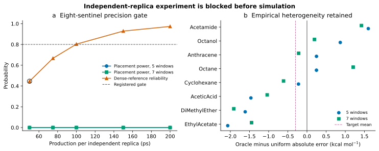

# Independent-replica resolution experiment

## Executive decision

**POWER-GATE STOP — no new PIMD2 simulation was launched.**

The registered eight-molecule, two-replica, 50-ps experiment is demonstrably incapable of resolving the effect required to justify a future placement-learning method. Its simulated detection probabilities are 0.00000 at five windows and 0.00001 at seven windows, and its probability of passing the dense-reference reliability criterion is 0.44602. All are below the prospectively frozen 0.80 gate.

Because the simulation was blocked before execution, decisions A, B and C are not assigned: those labels were reserved for a completed 50-ps independent-replica result. Assigning one would misrepresent a power calculation as experimental evidence.

## Provenance and immutability

| Item | Commit |
|---|---|
| Immutable Active SolvAI no-go | `8fb984c2eb26d016c6b81cf488f88dc667ca9cd3` |
| Immutable independent-noise audit | `f2cc60fb73416e0e417c97c600d5abd00868031c` |
| Prospective resolution freeze | `52827f851ed0d1a540b0492c63c3df269cf774e1` |
| Power-gate implementation and result | `3a8532e2c5fbbee7898f356a06fd9e7ba8c00177` |

The protocol was committed before the formal power calculation. No simulation configuration was generated and the GPU remained unused by this workstream.

## Frozen power result

The calculation retains the observed centered molecule-to-molecule effect pattern, shifts only its mean to the scientifically meaningful alternative of an oracle advantage of 0.30 kcal mol-1, and scales finite-trajectory residual variance from the existing 2.5-ps half-blocks by the registered inverse-time law. Each virtual experiment has two independent transfer directions. One hundred thousand Monte Carlo experiments were run with seed 20260904.

| Criterion | Five windows | Seven windows | Required |
|---|---:|---:|---:|
| Material-placement detection probability | 0.00000 | 0.00001 | >=0.80 at both |
| Conservative doubled-noise probability | 0.00003 | 0.00087 | descriptive |

The independent dense-reference projection passes its joint MAE/median criterion with probability 0.44602, compared with the required 0.80. The proposed campaign would use 12 ns of PIMD2 production, an estimated 32.44 production GPU-hours and a 36.01-GPU-hour operational reservation.



## Why the power is low

Finite-trajectory noise is only one limitation. After the existing molecule effects are centered and shifted to have a mean benefit of exactly 0.30 kcal mol-1, only four of eight sentinels at five windows and five of eight at seven windows favor oracle placement. The registered scientific conclusion requires benefit for at least 75% of molecules. Longer trajectories reduce measurement noise but do not turn a heterogeneous molecule effect into a broadly reproducible one. This is why power remains near zero even when the simulated trajectory length is increased to 200 ps.

The doubled-noise sensitivity can be numerically slightly less pessimistic for the joint criterion because additional noise occasionally changes the sign for molecules whose modeled effect is unfavorable. That does not indicate genuine information gain; both probabilities remain essentially zero.

## Alternative-design result

No design in the prospectively frozen grid (8--96 molecules; two replicas; 15 windows; 50--200 ps per replica) passes the full power and reliability rule. Under the empirical heterogeneity model, increasing sample size estimates the failure of the 75% consistency condition more precisely. Thus there is no finite adequately powered scale-up for the registered *stable-placement* claim without changing the scientific estimand or assuming a different molecule-effect distribution.

For the narrower question of detecting a mean advantage while dropping the consistency requirement, the first least-cost planning boundary is:

| Quantity | Planning-only alternative |
|---|---:|
| Molecules | 105 |
| Lambda windows per molecule | 15 |
| Independent replicas | 2 |
| Production per replica | 75 ps |
| Aggregate production | 236.25 ns |
| Power, five windows | 0.80094 |
| Power, seven windows | 0.81724 |
| Dense-reference reliability probability | 0.94008 |
| Projected production GPU-hours | 638.68 |
| Operational reservation | 708.94 GPU-hours |

This design is not recommended or authorized. It would test only an average effect and would not establish reproducible molecule-specific placement, which is the scientific premise of Active SolvAI v2. It also requires a new chemistry-first sentinel selection protocol and roughly twenty times the originally proposed compute.

## Scientific interpretation

The immutable Active SolvAI result remains a no-go for the tested acquisition policy. The independent-noise audit showed that the attractive same-curve oracle was optimistically selected on noisy responses. The present prospective power gate now shows that the proposed eight-molecule replication cannot cleanly distinguish stable placement headroom from heterogeneous/noisy behavior at the effect scale worth pursuing.

The justified recommendation is to close this PIMD2 placement formulation rather than spend 36 GPU-hours on an experiment unable to answer its own question. Neither new PIMD, Tier-B access, acquisition tuning nor trajectory extension is warranted by these data. A future program would need a substantially broader dense-curve corpus and a new prospective scientific design; it should not be described as continuation of this failed policy.

## Outputs and reproduction

- Freeze: `active_solvai/release/INDEPENDENT_REPLICA_RESOLUTION_FREEZE.md`
- Canonical result: `active_solvai/results/v2_independent_replicas/power/power_analysis.json`
- Complete frozen grid: `active_solvai/results/v2_independent_replicas/power/power_design_grid.csv`
- Effect inputs: `active_solvai/results/v2_independent_replicas/power/effect_variance_components.csv`
- Dense-reference inputs: `active_solvai/results/v2_independent_replicas/power/dense_reliability_inputs.csv`
- Planning-only boundary: `active_solvai/results/v2_independent_replicas/power/mean_only_planning_boundary.csv`
- Diagnostic figure: `active_solvai/figures/v2_independent_replicas/power_gate.svg`

Reproduce with:

```bash
uv run --project active_solvai python active_solvai/scripts/run_independent_replica_power.py
```

No molecule-level independent-replica prediction table exists because the prospective launch gate failed and no new response was generated.
